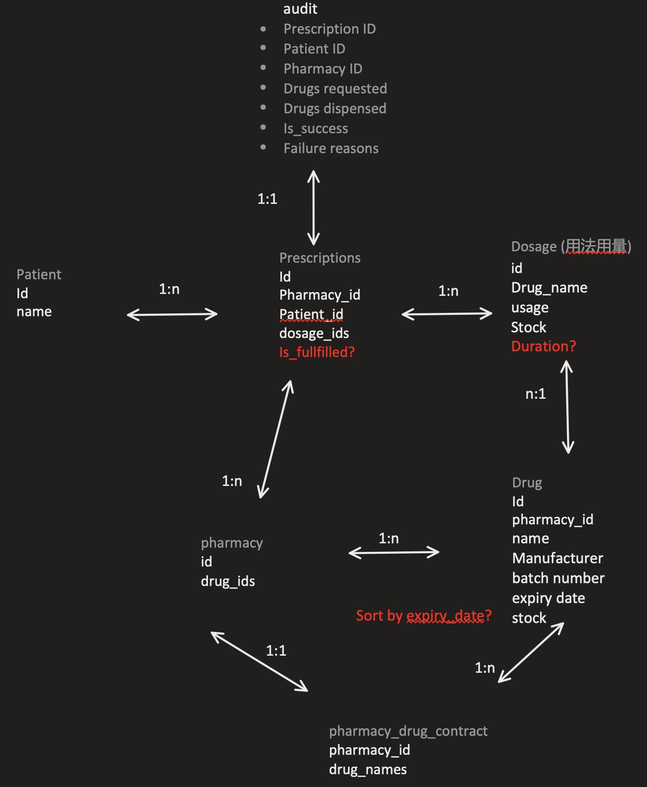

# Project Overview
Basic MVC architecture. Controller -> Service -> Repository

# Design Step
1. analysis the business first, extract the entities and their interactions
2. draw the ER diagram, find out the properties of each entity
3. ask LLM to generate DDL by entity properties
4. ask LLM to generate spring Entity class
5. ask LLM to generate an API & implementation based on the MVC architecture
6. review & update the code manually and let it run first
7. ask LLM to generate unit test based on fixed implementation

# Prerequisites
Java 17

# Setup Instructions
1. clone the project
2. run `./gradlew build` to build the project (download dependencies)
3. run `./gradlew bootRun` to start springboot

# API Documentation
todo: use swagger

# Testing Instructions
run `./gradlew test` to run both integration test & unit test

# Linting Instructions
run `./gradlew checkstyleTest`

# Assumption:
1. no pharmacy & patient & pharmacy drug contract relasionship edit API, use SQL to insert fix record
2. no updates for existing prescription
3. this service is behind the API gateway & auth service, consider the business logic only.

# To improve
1. optimize all the assumptions
2. using ELK to process the audit log instead of postgres
3. RBAC for postgres, currently using super user
4. use self-defined Exceptions to refactor the not found logic
5. using Redis to implement the lock